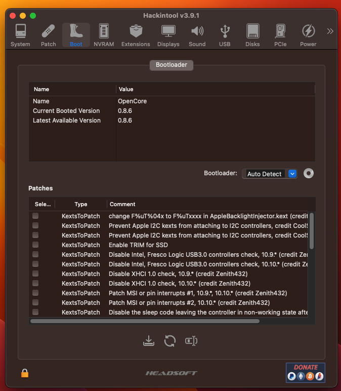
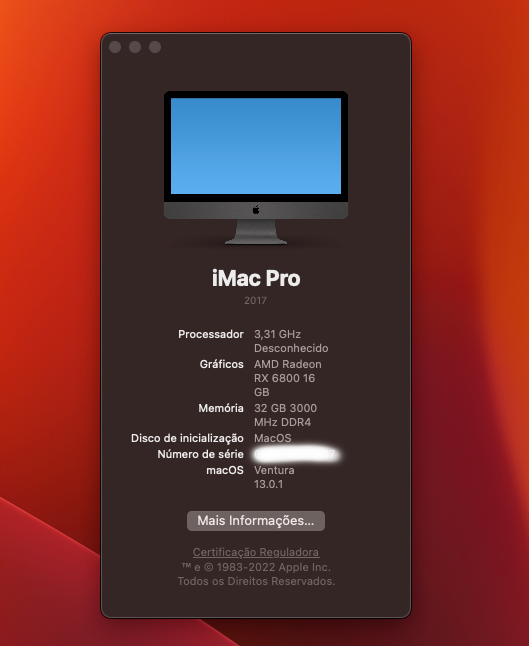
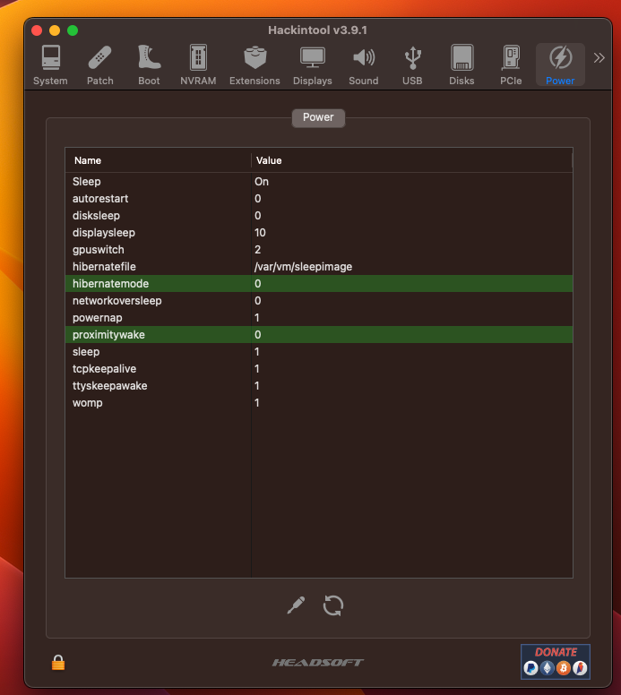

# Créditos

* [Dortania](https://github.com/dortania)
* [Acidanthera](https://github.com/acidanthera)
* [RehabMan](https://github.com/RehabMan)
* [OpenCore project](https://github.com/OpenCorePkg) bootloader
* **Olarila  Install and configuration  https://www.olarila.com/**
* **Canal do Gabriel Luchina** - Esse vai ajudar em tudo sobre hackintosh, se você procura uma canal com procedimentos bem explicados e em português, é esse:  https://www.youtube.com/@UniversoHackintosh

## OPEN CORE 0.8.6  - VENTURA 13.0.1

# hardware

* Intel i9-10900k
* Asus Z490 Vision H Gaming:
  * Áudio: Realtek ALC1220-VB
  * Ethernet de 2,5 Gbit: Intel I225-V
  * Duas portas USB-C/Thunderbolt 3
* RAM: 32GB Corsair
* GPU: AMD RX 6800
* Wifi/BT: Placa sem fio Intel 3168ngw

## Ethernet de 1 Gbit (Intel I219-V)

Basta adicionar o mais novo IntelMausiEthernet.kext (o meu é v2.5.1d1).

GitHub: [https://github.com/Mieze/IntelMausiEthernet](https://github.com/Mieze/IntelMausiEthernet)

## Consertando Suspender/Ativar

Nesta seção, quero mostrar como configuro meu sistema para que ele durma e acorde bem, mas não digo que você precisa exatamente dessas configurações para ter uma configuração adequada.

Além disso, defino as seguintes configurações no Hackintool. Você pode editá-los clicando no valor, mas tem uma área "clicável" bem pequena:

